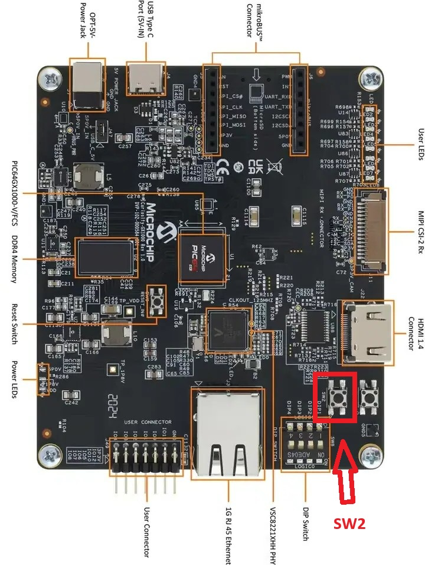
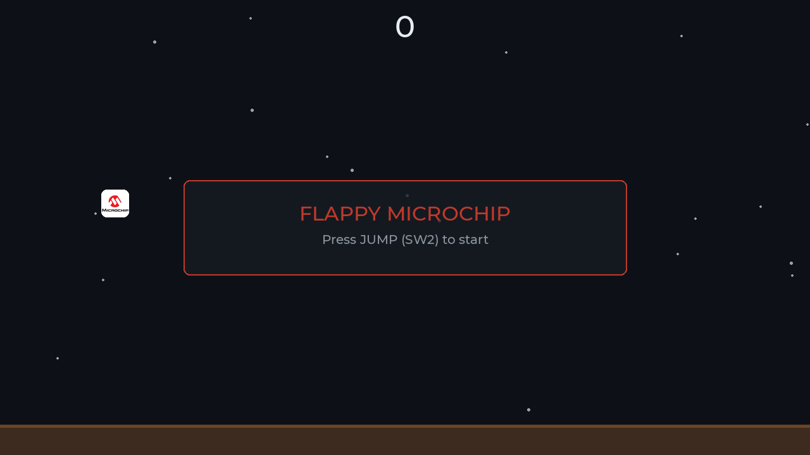

# Zephyr HelloFPGA

## Flappy Microchip on the PIC64GX Curiosity Kit




This repository contains a complete workshop example for building and running
Flappy Microchip with Zephyr RTOS on the Microchip PIC64GX Curiosity Kit.



## Dear hackers

Welcome to the nest.

In this workshop we will turn a PIC64GX board into a tiny Flappy Bird arcade.
The bird is the Microchip logo, the game runs on Zephyr RTOS and the final
image boots from an SD card. No cloud, no magic, no mysterious USB ritual.

There are several moving parts, because embedded systems enjoy making simple
things interesting. Follow the steps in order and the board should be flying
before your coffee gets cold.

## What you need

- Windows 10 or Windows 11
- WSL2 with an Ubuntu distribution
- Git access to the PIC64GX Zephyr application repository
- A Microchip PIC64GX Curiosity Kit
- A 720p HDMI monitor
- A USB-UART cable for the board console
- A microSD card with at least 32 MB
- An SD card reader connected to the Windows host

The commands in this guide use two shells:

- **WSL Ubuntu:** build Zephyr and create the payload
- **Windows PowerShell as Administrator:** write the payload to the SD card

## Repository layout

```text
Zephyr_HelloFPGA/
|-- README.md                         This guide
|-- scripts/
|   |-- env.sh                        Shared WSL environment
|   |-- setup_zephyr.sh               Install Zephyr tools and dependencies
|   |-- prepare_source.sh             Clone the app repo and apply the patch
|   |-- build_flappy.sh               Build the Zephyr application
|   `-- generate_payload.sh            Create payload.bin
|-- flappy-working-v1.patch           Known-good Flappy Microchip patch
|-- payload.bin                       Pre-built reference payload
|-- flash_sdcard.ps1                  Safe Windows SD card writer
|-- assets/                           Repository branding assets
|-- Handout/                          Workshop images
`-- snapshots/                        Reference files from a working build
```

The repository also contains older investigation scripts. They are kept for
reference. The scripts in `scripts/` are the recommended workshop path.

## Step 1: Install WSL2

Open **PowerShell as Administrator**. Skip this step if WSL2 and Ubuntu are
already available.

```powershell
wsl --install -d Ubuntu
```

Restart Windows if requested. Then open Ubuntu from the Start menu and create
your Linux user account.

## Step 2: Get this repository

If the repository is already available at `C:\developers\Zephyr_HelloFPGA`,
open WSL and run:

```bash
cd /mnt/c/developers/Zephyr_HelloFPGA
```

For a fresh clone, replace `<WORKSHOP_REPO_URL>` with the Git URL provided by
the workshop organizer:

```bash
git clone <WORKSHOP_REPO_URL> /mnt/c/developers/Zephyr_HelloFPGA
cd /mnt/c/developers/Zephyr_HelloFPGA
```

## Step 3: Set up Zephyr

Run this once in WSL:

```bash
bash scripts/setup_zephyr.sh
```

The script installs:

- Ubuntu build packages
- A Python virtual environment at `~/.zephyrenv`
- `west`
- Zephyr and its modules
- Zephyr Python requirements
- Zephyr SDK 1.0.1 with the RISC-V toolchain
- The HSS payload generator

The first `west update` downloads a lot of dependencies. This is normal. It
is not stuck. It is simply having a very productive day.

## Step 4: Get the Flappy Microchip source

The example application is maintained in the PIC64GX Zephyr application
repository. Run:

```bash
bash scripts/prepare_source.sh
```

By default, the script uses:

```text
https://bitbucket.microchip.com/scm/fpga-mcx/pic64gx-zephyr.git
```

The source is placed at:

```text
~/zephyr_git/pic64gx-zephyr
```

The script checks out the clean `main` branch and applies
`flappy-working-v1.patch`. The patch changes the demo to:

- Start directly in Flappy Microchip
- Use the Microchip logo as the player sprite
- Restart the game with SW2 after game over
- Include the logo image in the build
- Reserve enough cached RAM for the LVGL image widget

If the source repository is provided at another location, set the path before
running the script:

```bash
export PIC64GX_SOURCE_DIR="$HOME/zephyr_git/pic64gx-zephyr"
bash scripts/prepare_source.sh
```

If the source repository uses another Git URL, set:

```bash
export PIC64GX_SOURCE_URL="<PIC64GX_SOURCE_URL>"
```

## Step 5: Build Flappy Microchip

Load the shared environment and build the application:

```bash
source scripts/env.sh
bash scripts/build_flappy.sh
```

The build target is:

```text
pic64gx_curiosity_kit/pic64gx1000/u54/smp
```

The important build files are:

- `prj.conf`: Zephyr, SMP, UART, GPIO, display and LVGL settings
- `app.overlay`: display nodes and the cached Zephyr SRAM region
- `CMakeLists.txt`: application and display driver sources
- `hss-payload.yaml`: HSS configuration for the four U54 harts

After a successful build, the ELF file is here:

```text
~/zephyr/build/pic64_smp_hello/zephyr/zephyr.elf
```

## Step 6: Create the SD card image

Generate the HSS payload from the Zephyr ELF:

```bash
source scripts/env.sh
bash scripts/generate_payload.sh
```

The generated image is copied to:

```text
C:\developers\Zephyr_HelloFPGA\payload.bin
```

The script creates a temporary HSS YAML file with the correct local ELF path.
You do not need to edit a user-specific path such as `/home/m77107` by hand.
That particular form of archaeology has been removed from the workshop.

## Step 7: Flash the SD card

Insert the SD card into the Windows card reader. Open **PowerShell as
Administrator** and list the available disks:

```powershell
Get-Disk | Format-Table Number,FriendlyName,BusType,Size,IsBoot,IsSystem
```

Identify the SD card by its size and device name. Then flash it with the disk
number you verified:

```powershell
Set-ExecutionPolicy Bypass -Scope Process -Force
& "C:\developers\Zephyr_HelloFPGA\flash_sdcard.ps1" -DiskNumber 2
```

Replace `2` with the correct disk number. The script asks you to type `YES`
before writing. Read the disk information twice. A wrong disk number turns a
workshop into a data recovery exercise.

The HSS payload is written at sector `139264` (LBA `0x22000`). This is the
PIC64GX payload partition used by this example. Do not use sector `8192` for
this image.

## Step 8: Run the demo

1. Safely eject the SD card from Windows.
2. Insert it into the PIC64GX Curiosity Kit.
3. Connect the HDMI monitor.
4. Connect the USB-UART cable if you want console output.
5. Power on the board.
6. Press **SW2** to start Flappy Microchip.
7. Press **SW2** to flap and to restart after game over.

The UART console uses `115200 8N1`. The Zephyr shell is available at:

```text
uart:~$
```

Useful commands include:

```text
kernel threads
kernel stacks
kernel version
kernel uptime
```

## Quick reference

```bash
cd /mnt/c/developers/Zephyr_HelloFPGA
bash scripts/setup_zephyr.sh
bash scripts/prepare_source.sh
source scripts/env.sh
bash scripts/build_flappy.sh
bash scripts/generate_payload.sh
```

Then use PowerShell as Administrator:

```powershell
Get-Disk | Format-Table Number,FriendlyName,BusType,Size,IsBoot,IsSystem
& "C:\developers\Zephyr_HelloFPGA\flash_sdcard.ps1" -DiskNumber <SD_CARD_NUMBER>
```

## Troubleshooting

### `west: command not found`

Activate the virtual environment:

```bash
source scripts/env.sh
```

### The board target is not found

Check the Zephyr path:

```bash
echo "$ZEPHYR_BASE"
test -d "$ZEPHYR_BASE/boards/microchip/pic64gx_curiosity_kit" && echo "Board support found"
```

### The HSS generator cannot find the ELF

Build first and check:

```bash
ls -lh "$HOME/zephyr/build/pic64_smp_hello/zephyr/zephyr.elf"
```

Then run `bash scripts/generate_payload.sh` again.

### The board does not show HDMI output

Check the following:

- The payload was generated after the build.
- The SD card contains the new `payload.bin`.
- The correct physical disk was selected.
- The payload was written at sector `139264`.
- The monitor accepts a 1280x720 HDMI signal.

### PowerShell cannot write the SD card

Close File Explorer windows showing the SD card, run PowerShell as
Administrator and try again. The script locks and dismounts the card before
writing it.

## License and third-party material

The example source keeps the license information of its source repository.
Zephyr RTOS and the HSS payload generator are separate projects with their own
licenses. Check the corresponding upstream repositories before redistributing
the complete package.

## Contact

For workshop support, contact the session organizers. If the board starts
Flappy Microchip, congratulations. If it does not, congratulations on finding
the next challenge.
